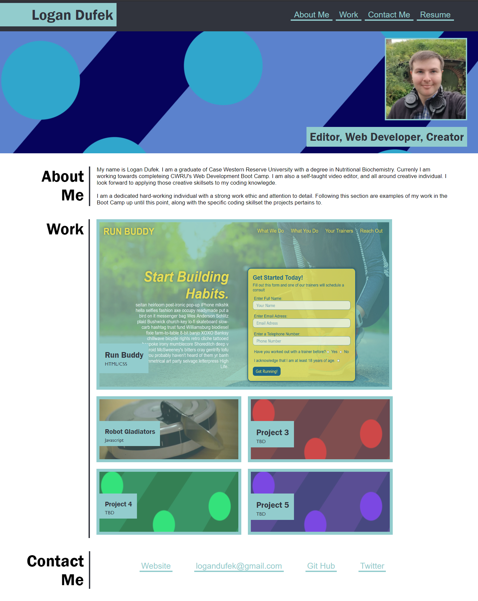

## Professional Portfolio

### Description
For this second weekly challenge, the task was to create a professional looking portfolio website from scratch using our existing HTML and CSS knowledge. I stuck close to the design template as requested while still adding some personal flair with the colors and a self-made hero image for fun. The website was also to be responsive and viewable through several different viewports. This was accomplished using Media Quieries. The intintion is likewise to update this website with more of my projects as I continue the boot camp. 

### Website Screenshot

#### Link to Live Site: 
https://logandufek.github.io/ChallengeTwoProfessionalPortfolio/